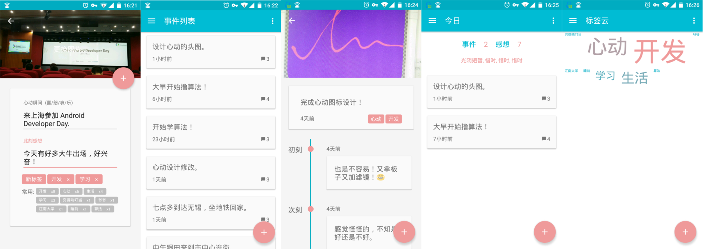

#心动

心动——记录生活中的心动瞬间。

##截图

##应用说明

心动，记录生活中的心动瞬间，帮您感悟生活，面对最真实的自我。
你可以把它当做是心灵的日记本，心灵的随笔录，甚至是心灵的照相机。

记录下生活中的每一个心动瞬间，添加您的感悟。

心动特色功能：

1. 事件列表分页：浏览生活中的大小事。

2. 今日分页：浏览当日事件，发表感想，记录新事件。

3. 事件详情分页：独特的时间轴效果，串起你的思绪。

4. 标签：给事件可添加多个标签，按标签分类浏览事件，方便你更好地组织心动事件。

5. 标签云分页：生活重心在哪里，在标签云中一览便知。

